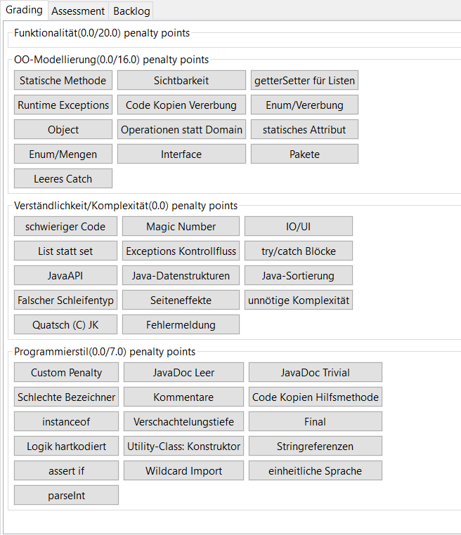
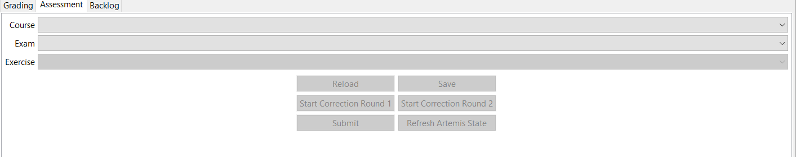
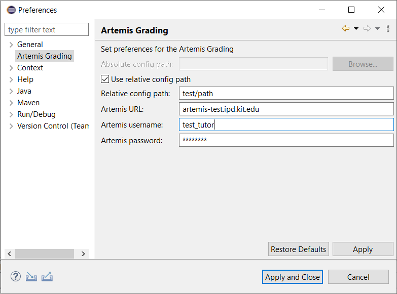
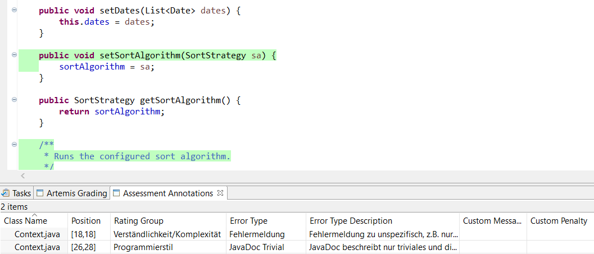
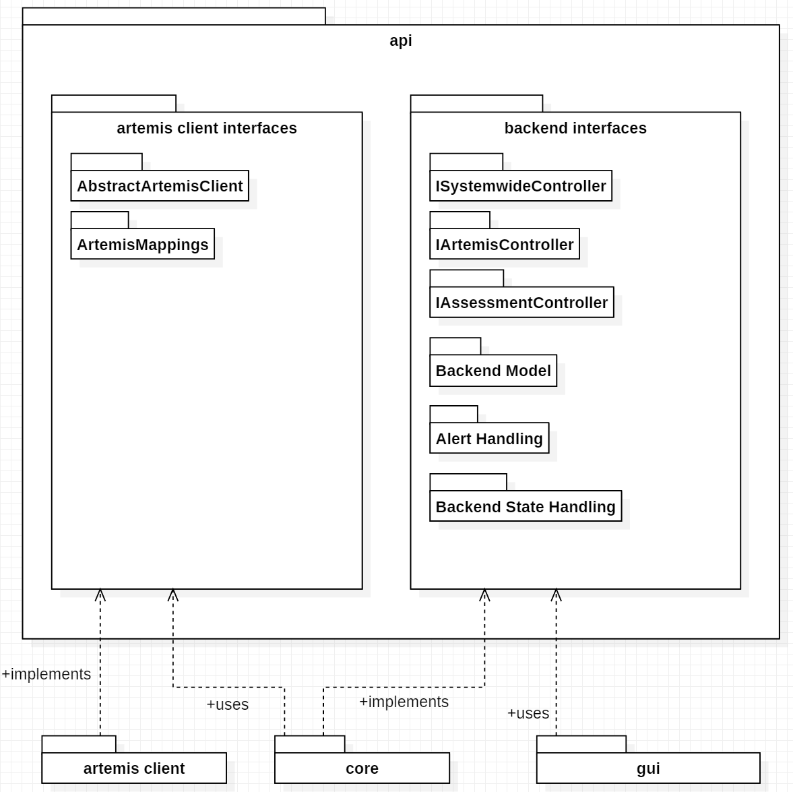

# programming-lecture-eclipse-artemis-grading
Eclipse-Plugin for grading with the [Artemis project](https://github.com/ls1intum/Artemis)

## Update Site
The Update Site is located here: https://kit-sdq.github.io/programming-lecture-eclipse-artemis-grading/

## Working with the plugin

### How do i run the plugin?

* Our Github CI run builds eclipse distros (linux, OS X, Windows) containing the plugin. Download it [here](https://github.com/kit-sdq/programming-lecture-eclipse-artemis-grading/actions/workflows/products.yml).
* In case you are using OS X, you might need to add our target platform to run the plugin. It can be found [here](docs/workingTargetDefinition.target).
* TODO marketplace or so?

### Working with the GUI
The gui consists (mainly) of two parts:

* Artemis Grading View
* Assessment Annotations View

Both can be open directly by open the Artemis Perspective.

#### Artemis Grading View

The Artemis Grading View is a tab folder with three tabs:

* Grading
* Assessment
* Backlog

#### Grading

The grading tab can be used to create annotations for the downloaded submission. The tab is generated whenever a new submission is downloaded.
For creating a new annotation do the following:

* Mark the lines, where the annotation should be
* Click on the mistake button in the certain rating group
* After that you should see the new annotation in the assessment annotation view.

#### Assessment
The assesment tab has the following functions:

* Select course, exercise and exam
* Start assessment (correction round 1 or 2)
* Refresh artemis state (if something changed)

After a new assessment is started, it is possible to reload, save or submit the started assesment (using the buttons).

#### Backlog

The backlog tab can be used to reload submissions that are already started, saved or submitted. One can filter the submission by selecting a filter in the first combo. 

It is important to selected the specified course and exercise in the assessment tab, otherwise the submission cannot be loaded. After a submission is loaded again, it can be graded and submitted normally. 

#### Artemis Grading Preferences

User data are persisted in the Artemis Grading Preferences. You can what you need to fill in down below. The relative path of the config refers to the downloaded project and can be activated by the check box. To update the preferences, the "Refresh Artemis State" button must be pressed in the Assessment tab. Otherwise the changes will only take effect after a restart.

#### Assessment Annotation View

The assessment annotation view shows the annotations of the downloaded submission. 
The annotation can be deleted by deleting the marker. 

### Backend Configuration

#### Configuration File
To Configure mistake types, rating groups and whatnot, we use a config file.
See [docs/config_v4.json](docs/examples/config_v4.json) for an example configuration.

There are rating groups, mistake types and penalty rules.
The main config features are explained in the following.

#### Rating Groups
A rating group consists of multiple mistake types and an optional *penaltyLimit*. That limit is used for penalty calculation.
<pre><code>
"ratingGroups": [
    ...,
    {
        "shortName": "modelling",
        "displayName": "OO-Modellierung",
        "penaltyLimit": 16
    }
]
</code></pre>

#### Mistake Types
A mistake type belongs to a rating group and has a penalty rule that defines the penalty calculation logic. Config File:
<pre><code>
"mistakeTypes" : [
    {
        "shortName": "custom",
        "button": "Custom Penalty",
        "message": "",
        "penaltyRule": {
            "shortName": "customPenalty"
        },
        "appliesTo": "style"
    },
    {
        "shortName": "jdEmpty",
        "button": "JavaDoc Leer",
        "message": "JavaDoc ist leer oder nicht vorhanden",
        "penaltyRule": {
            "shortName": "thresholdPenalty",
            "threshold": 1,
            "penalty": 5
        },
        "appliesTo": "style"
    }
]
</code></pre>
See the Development chapter for more info about creating a new PenaltyRule.

#### Penalty Calculation/ Artemis Mapping

Currently, there are two penalty rule types you may use in your config:

* ThresholdPenalty: Iff the number of annotations with the given mistakeType >= $threshold, then $penalty is added
* Custom Penalty: The tutor defines the message and the penalty.

Penalty Calculation is done rating-group-wise. For each rating group:

* all mistake types are evaluated: The corresponding annotations are used to calculate the mistake type's contribution.
* All mistake types' contributions are summed and optionally compared against the rating group's penalty limit which acts as a cap.
* Each annotation generates a MANUAL feedback, visible in the editor. No penalty points given, here!
* Each Rating group generates a MANUAL_UNREFERENCED feedback, visible *below* the editor (in the browser artemis client). Here, penalty points are given.
* Also, one (or more) MANUAL_UNREFERENCED feedback (invisible for students) is generated, which is used as a database for this client (containing serialized client-specific annotation data, including model identifiers, gui markers, startLine, endLine, ...)

## Development

### Setting up Eclipse

1. Use the docs/workingTargetDefinition.target to create the target platform needed for this project.
2. Adjust your Run Configuration accordingly ("Plugins->Select All" will do)

### Architecture
The architectural idea is based on having three plugins and an API plugin over which those plugins communicate.
That allows for more easily exchanging view, core/ backend or client and also clearly defines borders, making parallel work easier and reducing coupling.

#### Core/ Backend

Our backend (core package) provides functionality for

* managing annotations
* calculating penalties
* serializing and deserializing annotations (via artemis client as a network interface)
* mapping plugin-internal state to artemis-internal state
* keeping track of state

#### Artemis Client

The Artemis Client provides certain calls to artemis needed by the backend.

#### GUI

### Creating new view elements
New view elements (buttons, tabs, etc.) should be added to the *ArtemisGradingView* class. 
Every tab has got his own method (e.g *createBacklogTab(...)* ).

IMPORTANT:

If the new view element is state-dependent, you have to update the state machine and add it to the set in the view. Otherwise it will not be updated during the *updateState()* method. Use:

<pre><code>

	// replace YOUR_TRANSITION with the certain transition
	this.addControlToPossibleActions(yourNewViewElement, Transition.YOUR_TRANSITION);
	
</pre></code>

### New calls to the backend

New calls to the backend can be realized through the *ArtemisViewController* class. Then call the method in the view using the *ArtemisViewController*. 

When the class is getting to messy, it would be a good idea to separate the calls according to the backend controllers 

### Changing Preferences

The preference page is defined in the *ArtemisGradingPreferencesPage* class. 
A new field can be added in the *createFieldEditors()* method. 
The initial values are set in the *PreferenceInitializer* class.

An example with the field for the absolute config path:

<pre><code>

	public void createFieldEditors() {
		this.absoluteConfigPath = new FileFieldEditor(PreferenceConstants.ABSOLUTE_CONFIG_PATH,
				"Absolute config path: ", this.getFieldEditorParent());
		this.addField(this.absoluteConfigPath);
	}

</pre></code>

### Adding marker attributes

A new attribute to the marker can be added in the plugin.xml. If the field should appear in the Assessment Annotation View, a class needs to be created for the field and it must be added to the *markerSupportGenerator* in the plugin.xml. 

To make the name of the attribute easy to change, it should be defined as constant in the *AssessmentUtilities* class. The attribute should be set in the *addAssessmentAnnotaion(...)* method and the *createMarkerForAnnotation(...)* method in the *ArtemisViewController* class.

For examples just look in the plugin.xml at the *org.eclipse.ui.ide.markerSupport* extension and the *edu.kit.kastel.eclipse.grading.view.marker* package for the field classes.

### Creating a new PenaltyRule

1. Add a Class derived from *edu.kit.kastel.sdq.eclipse.grading.core.model.PenaltyRule*
2. Add a Constructor for that class in *edu.kit.kastel.sdq.eclipse.grading.core.config.PenaltyRuleDeserializer.PenaltyRuleType*.
    Note that herein, you have access to the penaltyRule's JsonNode, so you may fetch values you define in your config to construct your PenaltyRule:
    <pre><code>
    public enum PenaltyRuleType {
            //Need to add a new enum value with a short Name (that must be used in the config file) and a constructor based on the json node.
            THRESHOLD_PENALTY_RULE_TYPE (ThresholdPenaltyRule.SHORT_NAME, penaltyRuleNode -> new ThresholdPenaltyRule(penaltyRuleNode.get("threshold").asInt(), penaltyRuleNode.get("penalty").asDouble())),
            CUSTOM_PENALTY_RULE_TYPE (CustomPenaltyRule.SHORT_NAME, penaltyRuleNode -> new CustomPenaltyRule()),
            MY_NEW_PENALTY_RULE_TYPE (MyNewPenaltyRule.SHORT_NAME, penaltyRuleNode) -> new MyNewPenaltyRule(...));
    </code></pre>
3. use the new PenaltyRule in your config.json:
    <pre><code>
        "mistakeTypes" : [
            ...,
            {
                "shortName": "idk",
                "button": "MyMistakeType",
                "message": "You made a grave mistake.",
                "penaltyRule": {
                    "shortName": "myNewPenaltyRule",
                    "penalty": 5,
                    "penaltyOnMoreThanThreshold": 500,
                    "threshold": 4
                },
                "appliesTo": "style"
            }
        ]
    </code></pre>

### Controllers
There are three Controllers:

* The AssessmentController controlls a single assessment in terms of managing annotations. It provides Methods like
    * *addAnnotation(..)*
    * *getAnnotations()*
    * *resetAndRestartAssessment()*
    * *...*
* The ArtemisController handles artemis-related stuff, including
    * managing Locks and *Feedbacks* which contain data gotten from locking a submission.
    * retrieving information about Courses, Submissions, Exercises, Exams, ... from the artemis client
    * starting, saving and submitting assessments.
* The SystemwideController holds and manages the backend state.
  It acts as the main interface to the GUI.
  All calls relevant to our backend state (see section about the backend state machine) go through here.
  
### Backend State Machine

For keeping the backend state sane and consistent, we use a state machine. That also allows for greying out buttons in the gui:

TODO Further explain the state machine (code-wise)

* On every state-modifying call to *edu.kit.kastel.sdq.eclipse.grading.core.SystemwideController* (represented by transitions (edges) in the state machine graph), the according transition is applied in the state machine. If it isn't possible, the transition is not applied and the GUI is notified.
* Transitions are designed to represent button clicks in the GUI, which in turn are mapped to one backend call each.
* Each "transition class" (represented by its name) has **one single** *next_state* and multiple *from_state*s.
* In every state, it is known, which transitions are allowed. These are retrieved via ISystemwideController::getCurrentlyPossibleTransitions() by the GUI.
* In certain situations, a state is changed but then reverted. This is not done across calls, so the GUI does not notice it.

### Further Development

See our [Github Issues](https://github.com/kit-sdq/programming-lecture-eclipse-artemis-grading/issues) (especially feature requests/ enhancements and bugs).

## Authors

* Paul Rüssmann
* Robin Schulz