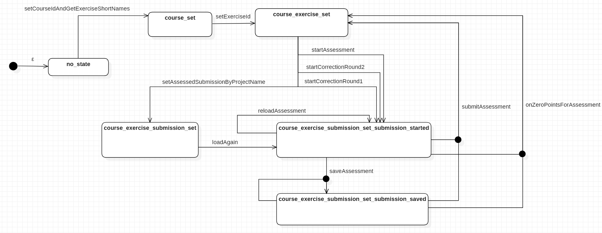

# programming-lecture-eclipse-artemis-grading
Eclipse-Plugin for grading with the [Artemis project](https://github.com/ls1intum/Artemis)

## Update Site
The Update Site is located here: https://kit-sdq.github.io/programming-lecture-eclipse-artemis-grading/

## Working with the plugin

### How do i run the plugin?

* Our Github CI run builds eclipse distros (linux, OS X, Windows) containing the plugin. Download it [here](https://github.com/kit-sdq/programming-lecture-eclipse-artemis-grading/actions/workflows/products.yml).
* TODO marketplace or so?

### Backend Configuration

#### Configuration File
To Configure mistake types, rating groups and whatnot, we use a config file.
See [docs/config_v4.json](docs/config_v4.json) for an example configuration.

There are rating groups, mistake types and penalty rules.
The main config features are explained in the following.

#### Rating Groups
A rating group consists of multiple mistake types and an optional *penaltyLimit*. That limit is used for penalty calculation.
<pre><code>
"ratingGroups": [
    ...,
    {
        "shortName": "modelling",
        "displayName": "OO-Modellierung",
        "penaltyLimit": 16
    }
]
</code></pre>

#### Mistake Types
A mistake type belongs to a rating group and has a penalty rule that defines the penalty calculation logic. Config File:
<pre><code>
"mistakeTypes" : [
    {
        "shortName": "custom",
        "button": "Custom Penalty",
        "message": "",
        "penaltyRule": {
            "shortName": "customPenalty"
        },
        "appliesTo": "style"
    },
    {
        "shortName": "jdEmpty",
        "button": "JavaDoc Leer",
        "message": "JavaDoc ist leer oder nicht vorhanden",
        "penaltyRule": {
            "shortName": "thresholdPenalty",
            "threshold": 1,
            "penalty": 5
        },
        "appliesTo": "style"
    }
]
</code></pre>
See the Development chapter for more info about creating a new PenaltyRule.

#### Penalty Calculation/ Artemis Mapping

Currently, there are two penalty rule types you may use in your config:

* ThresholdPenalty: Iff the number of annotations with the given mistakeType >= $threshold, then $penalty is added
* Custom Penalty: The tutor defines the message and the penalty.

Penalty Calculation is done rating-group-wise. For each rating group:

* all mistake types are evaluated: The corresponding annotations are used to calculate the mistake type's contribution.
* All mistake types' contributions are summed and optionally compared against the rating group's penalty limit which acts as a cap.
* Each annotation generates a MANUAL feedback, visible in the editor. No penalty points given, here!
* Each Rating group generates a MANUAL_UNREFERENCED feedback, visible *below* the editor (in the browser artemis client). Here, penalty points are given.
* Also, one (or more) MANUAL_UNREFERENCED feedback (invisible for students) is generated, which is used as a database for this client (containing serialized client-specific annotation data, including model identifiers, gui markers, startLine, endLine, ...)

### Frontend Configuration
TODO Frontend Config (gui)

## Development

### Setting up Eclipse

1. Use the docs/workingTargetDefinition.target to create the target platform needed for this project.
2. Adjust your Run Configuration accordingly ("Plugins->Select All" will do)

### Architecture
TODO architecture doc. (tolles Bild)

#### State Machine

For keeping the backend state sane and consistent, we use a state machine. That allows for greying out buttons in the gui:

TODO Further explain the state machine (code-wise)
* On every state-modifying call to *edu.kit.kastel.sdq.eclipse.grading.core.SystemwideController* (represented by edges in the state machine graph), the according transition is applied in the state machine. If it isn't possible, the transition is not applied and the GUI is notified.
* Each "transition class" (represented by its name) has **one single** *next_state* and multiple *from_state*s.
* In every state, it is known, which transitions are allowed. These are retrieved via ISystemwideController::getCurrentlyPossibleTransitions() by the GUI.
* In certain situations, a state is changed but then reverted. This is not done across calls, so the gui does not notice that.

### Creating a new PenaltyRule

1. Add a Class derived from *edu.kit.kastel.sdq.eclipse.grading.core.model.PenaltyRule*
2. Add a Constructor for that class in *edu.kit.kastel.sdq.eclipse.grading.core.config.PenaltyRuleDeserializer.PenaltyRuleType*.
    Note that herein, you have access to the penaltyRule's JsonNode, so you may fetch values you define in your config to construct your PenaltyRule:
    <pre><code>
    public enum PenaltyRuleType {
            //Need to add a new enum value with a short Name (that must be used in the config file) and a constructor based on the json node.
            THRESHOLD_PENALTY_RULE_TYPE (ThresholdPenaltyRule.SHORT_NAME, penaltyRuleNode -> new ThresholdPenaltyRule(penaltyRuleNode.get("threshold").asInt(), penaltyRuleNode.get("penalty").asDouble())),
            CUSTOM_PENALTY_RULE_TYPE (CustomPenaltyRule.SHORT_NAME, penaltyRuleNode -> new CustomPenaltyRule()),
            MY_NEW_PENALTY_RULE_TYPE (MyNewPenaltyRule.SHORT_NAME, penaltyRuleNode) -> new MyNewPenaltyRule(...));
    </code></pre>
3. use the new PenaltyRule in your config.json:
    <pre><code>
        "mistakeTypes" : [
            ...,
            {
                "shortName": "idk",
                "button": "MyMistakeType",
                "message": "You made a grave mistake.",
                "penaltyRule": {
                    "shortName": "myNewPenaltyRule",
                    "penalty": 5,
                    "penaltyOnMoreThanThreshold": 500,
                    "threshold": 4
                },
                "appliesTo": "style"
            }
        ]
    </code></pre>