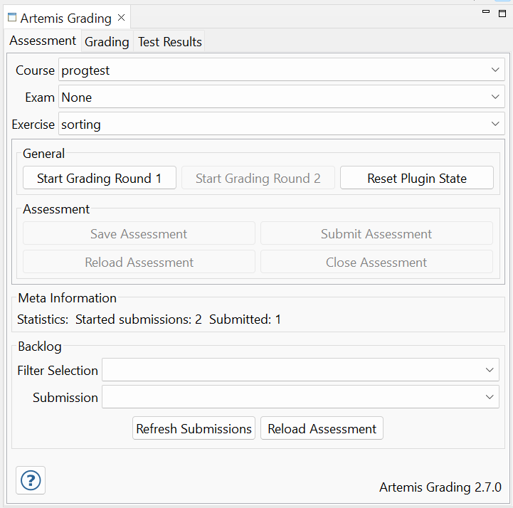
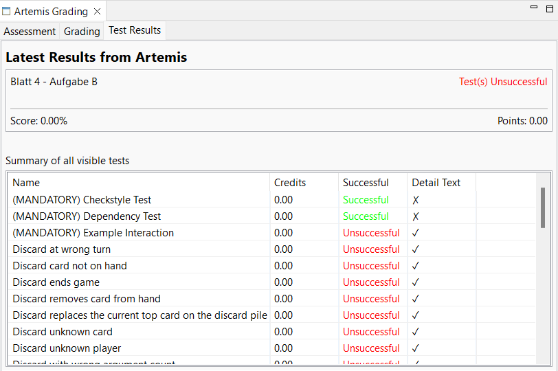
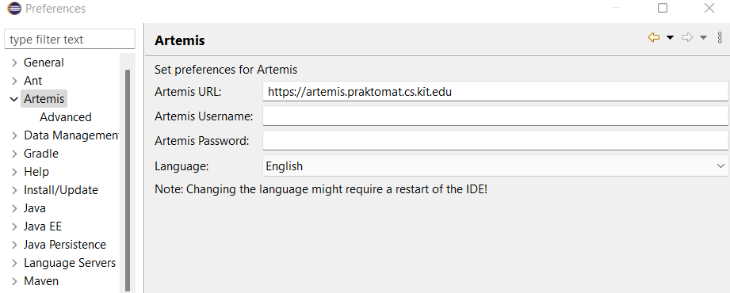
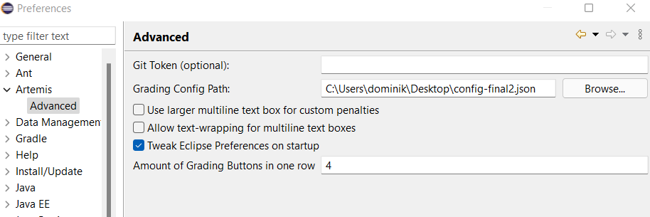
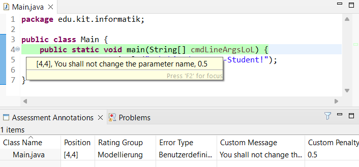

Grading Edition
===============

.. warning:: This docs might be deprecated!

Developers should look :doc:`here <grading.dev>`.

How do I run the plugin?
------------------------

* Our GitHub CI run builds eclipse distros (Linux / Windows) containing the plugin. Download it `here <https://github.com/kit-sdq/programming-lecture-eclipse-artemis/actions/workflows/products.yml>`_.
* In case you are using macOS, you might need to add our Update Site to run the plugin. It can be found `here <https://kit-sdq.github.io/programming-lecture-eclipse-artemis/>`_.

macOS User
^^^^^^^^^^

* The package bundle is missing notarization thus it cannot be opened by simply double-clicking it (cf. `#129 <https://github.com/kit-sdq/programming-lecture-eclipse-artemis/issues/129>`_).

.. image:: ../images/gatekeeper.png

* To open the application anyways, you have to open the context menu (right click) and select `Open`. This triggers the following dialog which allows you to circumvent Gatekeeper.

.. image:: ../images/gatekeeper-resolve.png

Working with the GUI
--------------------

The GUI consists (mainly) of two parts:

* Artemis Grading View
* Assessment Annotations View

Both can be open directly by open the Artemis Perspective.

Artemis Grading View
^^^^^^^^^^^^^^^^^^^^

The Artemis Grading View is a tab folder with three tabs:

* Assessment
* Grading
* Tests (show test results from artemis)

Assessment / Backlog
""""""""""""""""""""

The assessment tab has the following functions:

* Select course, exercise and exam
* Start assessment (correction round 1 or 2)
* Refresh Artemis state (if something changed)

After a new assessment is started, it is possible to reload, save or submit the started assessment (using the buttons).

The tab can be used to reload submissions that are already started, saved or submitted. One can filter the submission by selecting a filter in the first combo.
It is important to selected the specified course and exercise in the assessment tab, otherwise the submission cannot be loaded. After a submission is loaded again, it can be graded and submitted normally.

Grading
"""""""

The grading tab can be used to create annotations for the downloaded submission. The tab is generated whenever a new submission is downloaded.
For creating a new annotation do the following:

* Mark the lines, where the annotation should be
* Click on the mistake button in the certain rating group
* After that you should see the new annotation in the assessment annotation view.
* **Note: If you Shift-Click or Middle-Click a button, you can provide additional information for the student.**

.. image:: ../images/gradingedition_grading.png

Artemis Tests
"""""""""""""

The test view provides an overview on the test results of Artemis.
If there is some detail output, you can simply click on the row to read it.

Artemis Preferences
"""""""""""""""""""

User data are persisted in the Artemis Grading Preferences.
You can what you need to fill in down below.
To update the preferences, the "Refresh Artemis State" button must be pressed in the Assessment tab.
Otherwise, the changes will only take effect after a restart.

Assessment Annotation View
""""""""""""""""""""""""""

The assessment annotation view shows the annotations of the downloaded submission.
The annotation can be deleted by deleting the marker.

Backend Configuration
---------------------
This section deals with the configuration of the backend.

Configuration File
^^^^^^^^^^^^^^^^^^

To Configure mistake types, rating groups and whatnot, we use a config file.
See `docs/examples/config_v5.json <https://github.com/kit-sdq/programming-lecture-eclipse-artemis/blob/main/docs/examples/config_v5.json>`_ for an example configuration.

There are rating groups, mistake types and penalty rules.
The main config features are explained in the following.
Be aware of `"positiveFeedbackAllowed": true` which enables or disables the positive custom feedback ability.

Rating Groups
^^^^^^^^^^^^^

A rating group consists of multiple mistake types and an optional *penaltyLimit*. That limit is used for penalty calculation.

.. code-block:: json

    "ratingGroups": [
        {
            "shortName": "functionality",
            "displayName": "Funktionalität",
            "negativeLimit": -20,
            "positiveLimit": null
        }
    ]

Mistake Types
^^^^^^^^^^^^^

A mistake type belongs to a rating group and has a penalty rule that defines the penalty calculation logic. Config File:

.. code-block:: json

    "mistakeTypes" : [
        {
            "shortName": "custom",
            "button": "Custom Penalty",
            "message": "",
            "penaltyRule": {
                "shortName": "customPenalty"
            },
            "appliesTo": "functionality"
        },
        {
            "shortName": "jdEmpty",
            "button": "JavaDoc Leer",
            "message": "JavaDoc ist leer oder nicht vorhanden",
            "penaltyRule": {
                "shortName": "thresholdPenalty",
                "threshold": 1,
                "penalty": 5
            },
            "appliesTo": "functionality"
        },
        {
            "shortName": "stackingXY",
            "button": "Stacking (XY)",
            "message": "Hier wird mehrmals abgezogen",
            "penaltyRule": {
              "shortName": "stackingPenalty",
              "penalty": 0.5,
              "maxUses": 4
            },
            "appliesTo": "functionality"
        }
    ]

See the Development chapter for more info about creating a new `PenaltyRule`.

Penalty Calculation / Artemis Mapping
^^^^^^^^^^^^^^^^^^^^^^^^^^^^^^^^^^^^^

Currently, there are two penalty rule types you may use in your config:

* `ThresholdPenalty`: Iff the number of annotations with the given `mistakeType >= $threshold`, then `penalty` is added
* `CustomPenalty`: The tutor defines the message and the penalty.

Penalty Calculation is done rating-group-wise. For each rating group:

* all mistake types are evaluated: The corresponding annotations are used to calculate the mistake type's contribution.
* All mistake types' contributions are summed and optionally compared against the rating group's penalty limit which acts as a cap.
* Each annotation generates a MANUAL feedback, visible in the editor. No penalty points given, here!
* Each Rating group generates a `MANUAL_UNREFERENCED` feedback, visible *below* the editor (in the browser artemis client). Here, penalty points are given.
* Also, one (or more) MANUAL_UNREFERENCED feedback (invisible for students) is generated, which is used as a database for this client (containing serialized client-specific annotation data, including model identifiers, gui markers, startLine, endLine, ...)

