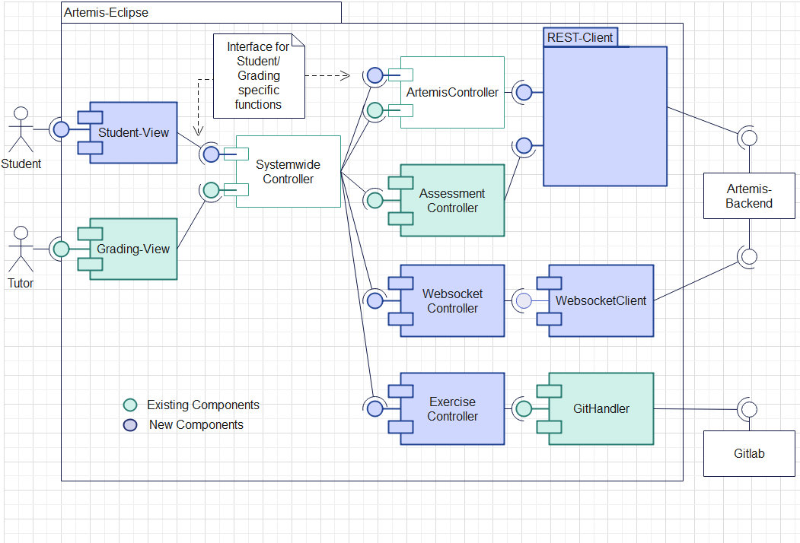

Student Edition (Development)
=============================

Install
-------
To install and run the product locally for development simply use Eclipse and install all plugins from the Update Site. For further readings follow "Development" from the Eclipse-Plugin for Grading.

Architecture
------------

The main architecture is based on the one presented in the grading-product. Only a few changes were made to split the two products. For further reading on these changes please read the “Main Changes” chapter.

The architectural idea is based on having four plugins and an API plugin over which those plugins communicate. That allows for more easily exchanging view, core/ Backend or client and also clearly defines borders, making parallel work easier and reducing coupling. The coarse architecture of the Grading-Plugin was reused and adapted to ensure a parallel development of both plugins and to enhance the reuse of code.

Common, Student and Grading View
""""""""""""""""""""""""""""""""

Those plugins create the GUI for both plugins. The provided functionalities are described in the “Working with the GUI” chapter. The common plugin provides shared functionality of the student and grading view.

Core/ Backend
"""""""""""""

The backend plugin (common.core) provides all fundamental functionalities for both plugins. It consists of multiple controllers. Each of these controllers has a single strictly defined purpose.

The SystemwideController acts as facade to all other specified controllers. Here an abstract super class was defined. For the student and the grading view a specific controller was created which extends the super controller.

The ArtemisController acts as facade to all REST-Clients. These are specified in the client-plugin. Similar to the SystemwideController, an abstract super class was created that provides functionality both views are using. View specific functions are provided by child classes.

The ExercicseController handles all git specific functionalities.

The WebsocketController connects to a websocket and handles websocket events.

The AssessmentController provides functionalities concerned with loading, editing and saving assessments. For further details have a look at the “Grading” chapter

ArtemisClient
"""""""""""""

Here mainly the REST-Clients are defined. For each domain a separate client was created. This helps to keep an overview on all implemented calls and therefore it is easier to find the desired REST-Calls.
The RestClientManager creates and stores all clients, to enable a simple use of all different clients.

Additionally, the websocket client is implemented here. The IWebsocketClient is concerned with setting up a websocket using the STOMP and SockJs protocol. On top of that, it is secured with SLL. The ArtemisSockJsSessionHandler handles incoming SockJs events. It subscribes to two topics. One that sends an event when a new submission was pushed to a git repo and one that sends an event when new results are available.
.. image:: ../images/studentedition_restclients.png

Main Changes
------------

The main architecture is based on the one presented in the grading-product. Only a few changes were made to split the two products. In the following these changes will be explained. For further readings on the architecture please read the Architecture chapter of the grading product.

To ensure a parallel development of the grading product and the student product, one focus was to split those two products as clean as possible, while using the same core functionalities. This enables to use bugfixes of the core to be used in both products and to reuse existing functionalities and code.

This resulted in splitting the existing controllers of the grading product in one for the student product and one for the grading product. This split happened in the SystemwideController as well as in the ArtemisController. Sometimes implemented functionalities were overwritten due to missing rights of a student compared to a tutor.
Both controllers were made abstract and two subclasses which extend the abstract class were introduced. One for the grading product and one for student product. Functionalities which are used of both products are set in the abstract class, and product specific in the subclasses. Additionally, the interfaces were adapted and split accordingly.

The ArtemisController kept a lot of functionalities which are currently not used by the student product, but are plant to be used in a later version. Also, the controller is meant to connect the SystemwideController with the Rest-Client, so all functionalities which are not concerned with REST-calls were outsourced in separate controllers.

Furthermore, the ArtemisClient was refactored, due to continuously growing interface and number of lines in the class.
Therefore, the interface was split in multiple interfaces by domain. For instance, an interface only for REST-calls concerned with exams was introduced. This allows a better encapsulation of logic and easier overview of the implemented Rest-calls.
## View and new functionalities
One main new functionality is the websocket. It is introduced in the client project and got an own controller interface. The IWebsocketClient is concerned with setting up a websocket using the STOMP and SockJs protocol. Additionally, it is secured with SLL. The ArtemisSockJsSessionHandler handles incoming SockJs events. It subscribes to two topics. One which sends an event when a new submission was pushed to a git repo and one which sends an event when new results are available.

The view is split in three tabs. The main tab is similar to the one used by the grading product. Here courses, exams and exercises can be selected. Selected exercises can than be started, submitted or cleaned. Starting an exam clones the git repository in the local workspace. Submitting an exam commits new changes and pushes them to origin git repository. Cleaning reverts all uncommitted changes.
In the Result tab results of the selected exercise are shown. Here you can see how many automatically executed tests were successful.
Functionality which is used by the view of both plugins were moved to a new project called edu.kit.kastel.sdq.eclipse.common.view
