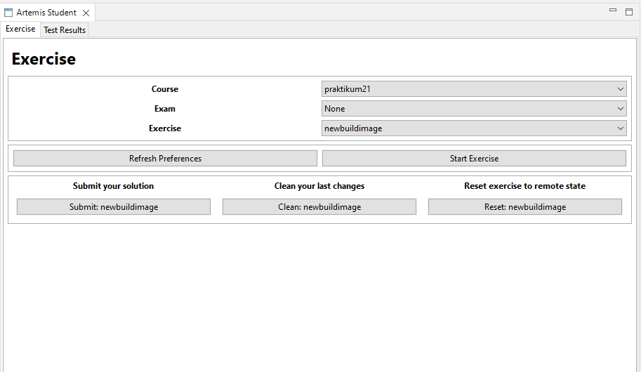
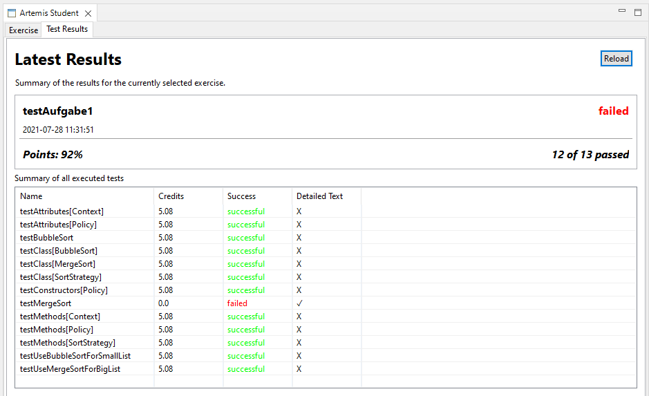

Student Edition
===============

Artemis Preferences
-------------------

User data are persisted in the Artemis Plugin Preferences. You can what you need to fill in down below.
To update the preferences, the "Refresh Preferences" button must be pressed in the Exercise tab.
Otherwise, the changes will only take effect after a restart.

.. image:: ../images/preferences.png

Working with the GUI
--------------------

Main-Tab
^^^^^^^^

The GUI consists of two parts. The first and main part is the exercise tab. Here the student selects the course, the exam and the exercise he wants to edit. If the student wants to edit a weekly exercise only, he must choose “None” as exam.
The student uses the “Start Exercise” – button to load the selected exercise into the local Eclipse workspace. In the background a “git clone” of the remote git repository with the exercise is executed. Now the student can open and edit the exercise in Eclipse.
To submit his solution the student uses the “Submit”- button. After a click on the button the selected exercise will be uploaded to a remote git repository. Hence, a git commit and a git push is executed in the background.

If the student wants to delete his last changes, he uses the “Clean”-button. It executes a clean on the local git repository.
If the student wants to reset the whole local repository, for example due to added files. The student either deletes the project including the exercise in Eclipse or he uses the reset button. If he chooses the first option, he needs to make sure to delete the whole folder of the disk as well and needs to start the exercise again. The reset button on the other hand deletes the project of the selected exercises and clones the repository again automatically.
The last button “Refresh Preferences” on the main part refreshes the set properties of the preferences tab and tries to reconnect to Artemis via REST and via websocket connection.

Result-Tab
^^^^^^^^^^

The second part is the Result tab. Here the latest results of the selected exercise are shown.

In the first part of the tab general information about the result is shown. For instance, it is shown if the student succeeded the exercise, how many tests he failed or succeeded and what day and time the result was created.

In the second part all executed tests are shown in a table. Here the student can see which tests he failed and maybe further information on each individual test.

Exam Handling
^^^^^^^^^^^^^

To start an exam the student must select the exam in the main tab. The student will than be asked if he wants to start the exam. Afterwards, the student selects the exercises of the started exam. Here the exercises can be edited, submitted and cleaned as normal exercises.

Beneath the buttons all information about the exam is shown, for example the due date.
To end the exam the student has to end the exam with the artemis website. It is not possible to end the exam in Eclipse.

.. image:: ../images/studentedition_exams.png

Artemis-Student-Preferences
^^^^^^^^^^^^^^^^^^^^^^^^^^^
User data are persisted in the preferences. Here the student sets the base URL to Artemis and sets the user credentials. To update the preferences the "Refresh Preferences" button must be pressed in the main tab.
Otherwise, the changes will only take effect after a restart.

